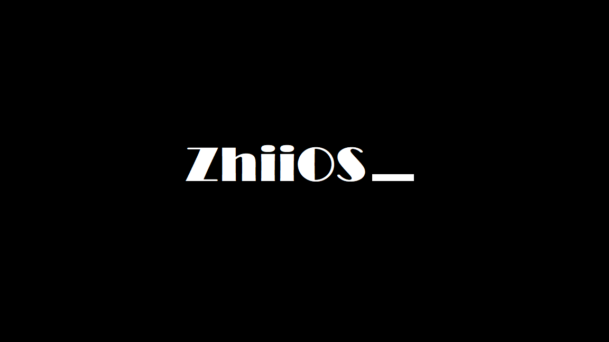

[简体中文](./README.md)

# Welcome to ZhiiOS!

Latest version: 11.01 
*If you want to get the official version of ZhiiOS directly, go to the /release branch and select the ISO file of the corresponding version*

## About ZhiiOS

- ZhiiOS is an open-source operating system based on the Unix core
- The naming rules for ZhiiOS versions are as follows: the first two digits are the external version number, such as 11, which is the first version of ZhiiOS 1. The last two digits are the build number, e.g. 01 is the first release of that version 

Give your feedback: Send an email to zhiixiiang2021@163.com

